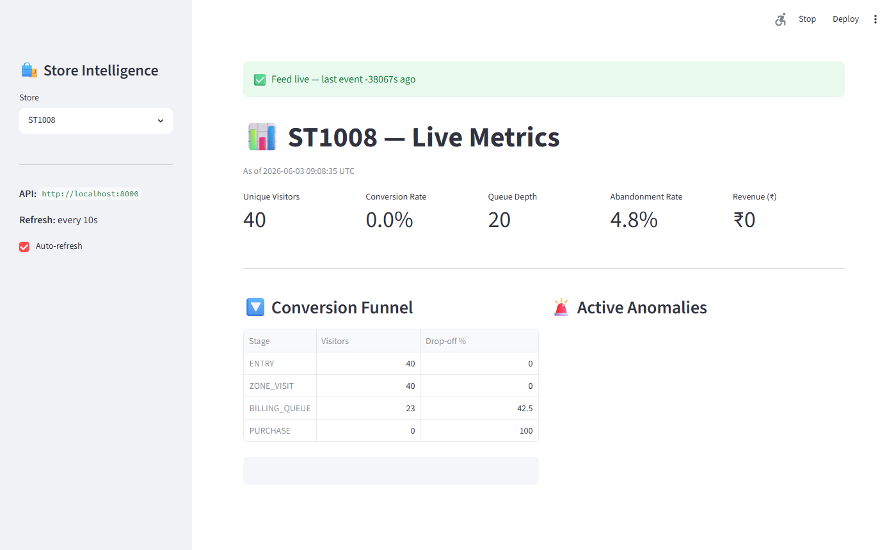
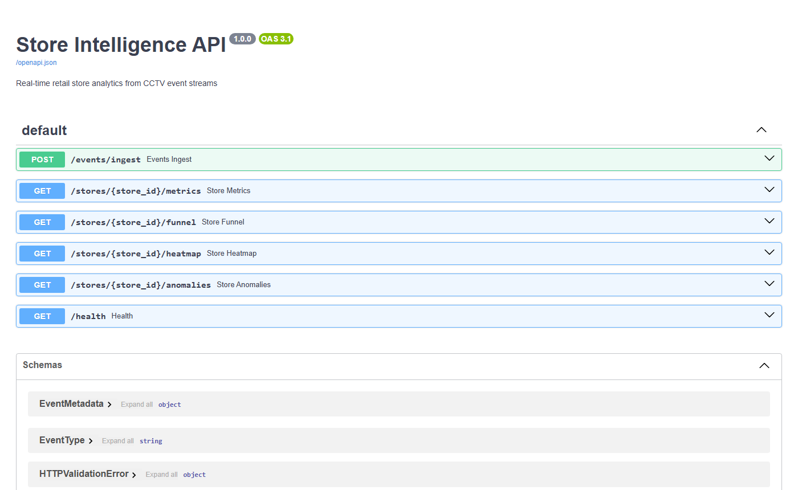
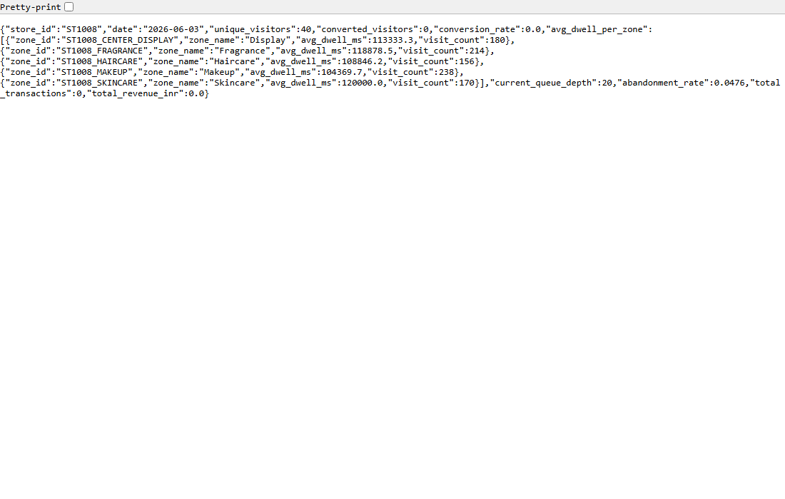

# Store Intelligence — Purplle Tech Challenge 2026

> **North Star Metric**: Offline Store Conversion Rate = Visitors who purchased ÷ Total unique visitors

A complete end-to-end retail store analytics system: raw CCTV footage → detection pipeline → live REST API → Streamlit dashboard.

---

## Live Screenshots

### Dashboard — Live Metrics, Funnel & Anomalies


### API — Swagger UI (all 6 endpoints)


### API — /stores/ST1008/metrics response


---

## Component Architecture

```
┌─────────────────────────────────────────────────────────────────────┐
│                        CCTV Footage                                 │
│          Store 1 (4 cameras)    Store 2 (4 cameras)                 │
└───────────────────────┬─────────────────────────────────────────────┘
                        │
                        ▼
┌─────────────────────────────────────────────────────────────────────┐
│                   Detection Pipeline  (pipeline/)                   │
│                                                                     │
│  ┌─────────────┐   ┌──────────────┐   ┌────────────────────────┐   │
│  │  detect.py  │   │  tracker.py  │   │  zone_classifier.py    │   │
│  │  YOLOv8n    │──▶│  ByteTrack   │──▶│  Point-in-Polygon      │   │
│  │  Person     │   │  Re-ID       │   │  Zone Assignment       │   │
│  │  Detection  │   │  Cross-cam   │   │  (store_layout.json)   │   │
│  └─────────────┘   │  Dedup       │   └────────────────────────┘   │
│                    └──────┬───────┘                                 │
│                           │                                         │
│  ┌─────────────────┐      │   ┌─────────────────────────────────┐  │
│  │ staff_detector  │      │   │          emit.py                │  │
│  │ HSV Uniform     │──────┴──▶│  8 Event Types → HTTP Batch    │  │
│  │ Colour Match    │          │  ENTRY / EXIT / ZONE_ENTER /   │  │
│  └─────────────────┘          │  ZONE_EXIT / ZONE_DWELL /      │  │
│                               │  BILLING_QUEUE_JOIN /          │  │
│        run.sh ──────────────▶ │  BILLING_QUEUE_ABANDON /       │  │
│        (one command,          │  REENTRY                       │  │
│         all stores)           └────────────────┬────────────────┘  │
└────────────────────────────────────────────────┼────────────────────┘
                                                 │ POST /events/ingest
                                                 ▼
┌─────────────────────────────────────────────────────────────────────┐
│                   Intelligence API  (app/)                          │
│                                                                     │
│  ┌──────────────┐  ┌──────────────────────────────────────────────┐ │
│  │ ingestion.py │  │              SQLite (WAL mode)               │ │
│  │ Idempotent   │─▶│   events table  ·  pos_transactions table   │ │
│  │ by event_id  │  └───────────┬──────────────────────────────────┘ │
│  └──────────────┘              │                                   │
│                                ▼                                   │
│  ┌───────────────────────────────────────────────────────────────┐ │
│  │                    API Endpoints                              │ │
│  │                                                               │ │
│  │  POST /events/ingest    → validate · dedup · store           │ │
│  │  GET  /stores/{id}/metrics   → visitors · conversion · queue │ │
│  │  GET  /stores/{id}/funnel    → Entry→Zone→Billing→Purchase   │ │
│  │  GET  /stores/{id}/heatmap   → zone scores 0–100            │ │
│  │  GET  /stores/{id}/anomalies → QUEUE_SPIKE·CONV_DROP·DEAD   │ │
│  │  GET  /health                → feed lag · STALE_FEED         │ │
│  └───────────────────────────────────────────────────────────────┘ │
│                                                                     │
│  telemetry.py → structured JSON logs (trace_id, latency_ms, ...)  │
└─────────────────────────────────┬───────────────────────────────────┘
                                  │
                                  ▼
┌─────────────────────────────────────────────────────────────────────┐
│              Live Dashboard  (dashboard/live_dashboard.py)          │
│                                                                     │
│   Streamlit · auto-refresh 10s · store selector sidebar            │
│   Metrics bar · Funnel chart · Anomaly panel · Zone heatmap        │
└─────────────────────────────────────────────────────────────────────┘
```

---

## Data Flow

```
CCTV Clip
   │
   │  15 fps frames
   ▼
YOLOv8n ──── detects persons (class 0, conf > 0.35)
   │
   ▼
ByteTrack ── assigns track_id, persists through occlusion
   │
   ├── Zone Classifier ── centroid point-in-polygon → zone_id
   ├── Staff Detector  ── HSV upper-body colour → is_staff flag
   └── Re-ID Manager   ── cosine similarity histogram → visitor_id
              │
              │  re-entry detected → REENTRY event
              │  cross-camera match → same visitor_id
              ▼
        EventEmitter ── batches 50 events → POST /events/ingest
              │
              ▼
        Intelligence API stores + computes in real time
              │
              ▼
        Dashboard renders live metrics
```

---

## Quick Start (5 commands)

```bash
# 1. Clone
git clone https://github.com/mridulkumar2074/Store-Intelligence-Purplle.git
cd Store-Intelligence-Purplle

# 2. Install & start API
pip install -r requirements.txt
uvicorn app.main:app --reload --port 8000

# 3. Check health (sample events auto-loaded)
curl http://localhost:8000/health

# 4. View metrics
curl http://localhost:8000/stores/ST1008/metrics

# 5. Open dashboard
pip install -r requirements-dashboard.txt
streamlit run dashboard/live_dashboard.py
```

Open **http://localhost:8501** for the dashboard · **http://localhost:8000/docs** for Swagger UI.

---

## Running the Detection Pipeline Against CCTV Clips

```bash
pip install -r requirements-pipeline.txt

# Single camera
python -m pipeline.detect \
  --store-id ST1008 \
  --camera-id CAM_ENTRY \
  --video "Store 1/CAM 3 - entry.mp4" \
  --camera-type entry \
  --layout data/store_layout.json \
  --api-url http://localhost:8000 \
  --pos-csv data/pos_transactions.csv

# All cameras — both stores
bash pipeline/run.sh --api-url http://localhost:8000
```

---

## Docker

```bash
docker compose up -d api
# Dashboard:
docker compose up -d dashboard
# Detection pipeline against clips:
docker compose --profile pipeline up pipeline
```

---

## API Reference

| Method | Endpoint | Description |
|--------|----------|-------------|
| POST | `/events/ingest` | Ingest up to 500 events. Idempotent by `event_id`. |
| GET | `/stores/{id}/metrics` | Unique visitors, conversion rate, queue depth, abandonment |
| GET | `/stores/{id}/funnel` | Entry → Zone → Billing → Purchase funnel with drop-off % |
| GET | `/stores/{id}/heatmap` | Zone visit frequency + avg dwell, normalised 0–100 |
| GET | `/stores/{id}/anomalies` | BILLING_QUEUE_SPIKE / CONVERSION_DROP / DEAD_ZONE |
| GET | `/health` | Service health + STALE_FEED detection per store |

---

## Event Schema

```json
{
  "event_id": "uuid-v4",
  "store_id": "ST1008",
  "camera_id": "CAM_ENTRY",
  "visitor_id": "VIS_c8a2f1",
  "event_type": "ZONE_DWELL",
  "timestamp": "2026-04-10T14:22:10Z",
  "zone_id": "ST1008_SKINCARE",
  "dwell_ms": 30000,
  "is_staff": false,
  "confidence": 0.91,
  "metadata": {
    "queue_depth": null,
    "sku_zone": "SKINCARE",
    "session_seq": 5
  }
}
```

**Event types:** `ENTRY` · `EXIT` · `ZONE_ENTER` · `ZONE_EXIT` · `ZONE_DWELL` · `BILLING_QUEUE_JOIN` · `BILLING_QUEUE_ABANDON` · `REENTRY`

---

## Project Structure

```
├── app/                        FastAPI Intelligence API
│   ├── main.py                 Entrypoint + POS/event auto-loader
│   ├── models.py               Pydantic schemas
│   ├── database.py             SQLAlchemy + SQLite WAL
│   ├── ingestion.py            Idempotent event ingest
│   ├── metrics.py              Real-time metric computation
│   ├── funnel.py               Session-based funnel logic
│   ├── heatmap.py              Zone normalisation (0–100)
│   ├── anomalies.py            3 anomaly detectors
│   ├── health.py               STALE_FEED detection
│   └── telemetry.py            Structured JSON logging
├── pipeline/                   CCTV Detection Pipeline
│   ├── detect.py               YOLOv8n + ByteTrack main loop
│   ├── tracker.py              Re-ID + cross-camera dedup
│   ├── zone_classifier.py      Ray-casting point-in-polygon
│   ├── staff_detector.py       HSV uniform colour detection
│   ├── emit.py                 Event builder + HTTP emission
│   └── run.sh                  One-command clip processor
├── dashboard/
│   └── live_dashboard.py       Streamlit live dashboard
├── assets/                     Screenshots
├── data/
│   ├── store_layout.json       Zone polygons (ST1008 + ST1076)
│   └── pos_transactions.csv    101 POS transaction records
├── sample_events/
│   ├── events.jsonl            828 synthetic schema-valid events
│   ├── generate_sample.py      Synthetic event generator
│   └── convert_pos.py          POS CSV → normalised JSON
├── tests/                      71 tests · 73% coverage
├── docs/
│   ├── DESIGN.md               Architecture + AI-Assisted Decisions
│   └── CHOICES.md              3 decisions with full trade-off reasoning
├── Dockerfile
├── Dockerfile.pipeline
└── docker-compose.yml
```

---

## Tests

```bash
pip install pytest pytest-cov httpx
pytest --cov=app --cov=pipeline --cov-report=term-missing
# 71 passed · 73% coverage
```

---

## Scaling to Production

| Concern | Current | Production Path |
|---------|---------|-----------------|
| Database | SQLite WAL | PostgreSQL + TimescaleDB (`DATABASE_URL` env var) |
| Event throughput | Batch HTTP | Kafka / Kinesis stream consumer |
| Re-ID accuracy | Colour histogram | OSNet deep Re-ID (GPU required) |
| Dashboard | Streamlit polling | WebSocket push + React frontend |
| Multi-store | Sequential processing | Kubernetes jobs per store |
